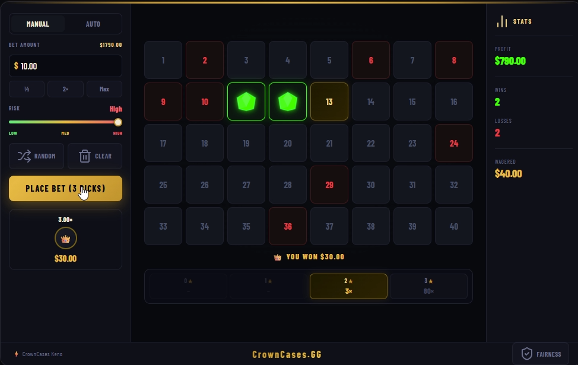

# 👑 CrownCases Keno

<p align="center">
  
</p>

A modern, fast-paced casino-style Keno web application branded for **CrownCases.GG**. Built with **Python (Flask)** and **SQLite**, featuring a sleek gold-and-dark UI, three risk modes, real-time statistics, provably fair draws, and immersive sound effects.

---

## 🎮 Features

* **Three Risk Modes:** Switch between **Low (Classic)**, **Medium**, and **High** risk via the in-game slider — each mode offers a different multiplier curve. Higher risk = bigger potential payouts with more variance.
* **Pick 1–10 Numbers:** Select from a grid of 40 numbers. The payout bar and prize box update live as you pick.
* **Live Dashboard:** Real-time tracking of **Profit**, **Wins**, **Losses**, and **Total Wagered** in the side panel.
* **Prize Preview:** The prize box shows the maximum possible multiplier and USD payout for your current bet and selection before you play.
* **Immersive Audio:** Custom Web Audio engine with:
    * *Soft click* — number selection
    * *Mechanical ticks* — drawn misses
    * *Crisp dings* — gem hits
    * *Victory chime* — winning round
* **Visual Feedback:**
    * 💎 **Green Gems** animate over matched (hit) numbers
    * 🔴 **Red text** highlights drawn numbers that were missed
    * Dynamic **Payout Bar** (multiplier + star count) highlights the active result tier
* **USD Currency:** All balances, bets, and payouts displayed in USD (`$`)
* **Provably Fair:** Every draw is seeded using SHA-256 combining a server seed, your client seed, and a nonce. You can set a custom client seed and verify results in the Fairness modal.
* **CrownCases Branding:** Gold gradient accents, dark metallic palette, Barlow Condensed typography — fully on-brand with CrownCases.GG.
* **Persistent Database:** Auto-creates `crowncases_keno.db` on first run. Stores full game history including risk mode, seeds, and payouts.

---

## 🛠️ Tech Stack

| Layer | Technology |
|---|---|
| Backend | Python 3, Flask |
| Database | SQLite3 |
| Frontend | HTML5, CSS3 (Flexbox/Grid), Vanilla JS (Fetch API) |
| Fonts | Barlow Condensed (Google Fonts) |
| Icons | Lucide Icons |

---

## 🚀 Installation & Setup

1. **Clone or download** this repository.

2. **Install Flask:**
    ```bash
    pip install flask
    ```

3. **Run the application:**
    ```bash
    python app.py
    ```

4. **Open in your browser:**
    ```
    http://127.0.0.1:5000
    ```

The database (`crowncases_keno.db`) is created automatically on first run with a starting balance of **$1,000.00**.

---

## 📂 Project Structure

```
CrownCases_Keno/
│
├── app.py                    # Flask backend — game logic, DB, API routes
├── crowncases_keno.db        # Auto-generated SQLite DB (balance & history)
├── README.md                 # This file
└── templates/
    └── index.html            # Complete frontend (UI, styles, scripts)
```

---

## 🎲 Payout Tables

Payouts scale with the number of picks and risk mode selected.

### 🟢 Low (Classic)

| Picks | Multipliers by Hits |
|---|---|
| 1 | 1→ 3.96× |
| 2 | 2→ 15× |
| 3 | 2→ 1.5×, 3→ 36× |
| 4 | 2→ 1.2×, 3→ 5×, 4→ 80× |
| 5 | 2→ 0.5×, 3→ 3×, 4→ 12×, 5→ 300× |
| 6 | 3→ 1×, 4→ 5×, 5→ 30×, 6→ 500× |
| 7 | 3→ 0.5×, 4→ 3×, 5→ 15×, 6→ 100×, 7→ 700× |
| 8 | 4→ 1.5×, 5→ 10×, 6→ 50×, 7→ 300×, 8→ 800× |
| 9 | 4→ 1×, 5→ 5×, 6→ 30×, 7→ 100×, 8→ 500×, 9→ 900× |
| 10 | 5→ 2×, 6→ 15×, 7→ 80×, 8→ 400×, 9→ 800×, 10→ 1000× |

### 🟡 Medium

| Picks | Multipliers by Hits |
|---|---|
| 1 | 1→ 3.96× |
| 2 | 2→ 17× |
| 3 | 2→ 2×, 3→ 50× |
| 4 | 2→ 1.5×, 3→ 6×, 4→ 120× |
| 5 | 2→ 0.5×, 3→ 4×, 4→ 18×, 5→ 450× |
| 6 | 3→ 1.5×, 4→ 7×, 5→ 50×, 6→ 750× |
| 7 | 3→ 0.75×, 4→ 5×, 5→ 25×, 6→ 150×, 7→ 1000× |
| 8 | 4→ 2×, 5→ 15×, 6→ 80×, 7→ 450×, 8→ 1200× |
| 9 | 4→ 1.5×, 5→ 8×, 6→ 50×, 7→ 160×, 8→ 750×, 9→ 1400× |
| 10 | 5→ 3×, 6→ 25×, 7→ 120×, 8→ 600×, 9→ 1200×, 10→ 2000× |

### 🔴 High

| Picks | Multipliers by Hits |
|---|---|
| 1 | 1→ 3.96× |
| 2 | 2→ 22× |
| 3 | 2→ 3×, 3→ 80× |
| 4 | 3→ 8×, 4→ 240× |
| 5 | 3→ 5×, 4→ 30×, 5→ 750× |
| 6 | 4→ 10×, 5→ 100×, 6→ 1500× |
| 7 | 4→ 7×, 5→ 50×, 6→ 300×, 7→ 2500× |
| 8 | 5→ 25×, 6→ 150×, 7→ 800×, 8→ 4000× |
| 9 | 5→ 15×, 6→ 80×, 7→ 400×, 8→ 2000×, 9→ 6000× |
| 10 | 6→ 40×, 7→ 250×, 8→ 1500×, 9→ 5000×, 10→ 10000× |

---

## 🔒 Provably Fair

Every draw is provably fair using a SHA-256 hash combining three components:

```
hash = SHA256(server_seed : client_seed : nonce)
```

- **Server Seed** — a secret pre-committed seed held by the server
- **Client Seed** — set by you in the Fairness modal (randomized by default)
- **Nonce** — the total number of games played, increments each round

The resulting hash seeds the random draw. After each game, the full `server_seed:client_seed:nonce` string is returned so you can independently verify the result using any SHA-256 tool.

**To verify a result:**
1. Copy the revealed seed string from the Fairness modal after a game
2. Run `SHA256(revealed_seed)` using any SHA-256 calculator
3. Compare the output to the hash shown in the Fairness modal

---

*CrownCases Keno — Built for CrownCases.GG*
